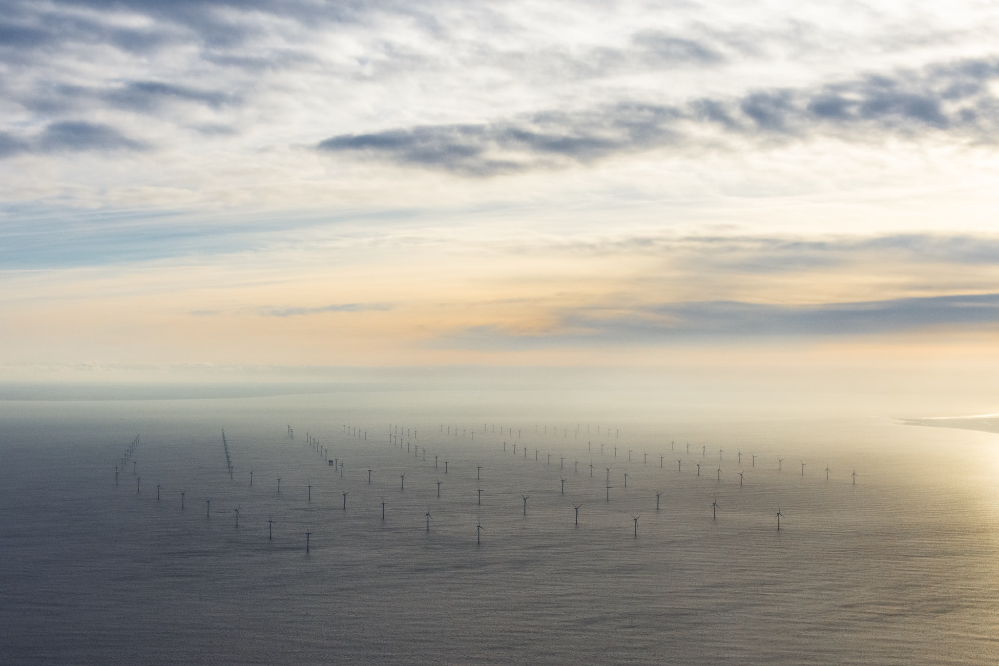

# Fix climate wiki

Catalog of problems the global warming is producing and solutions contributed by the community of anyone interested to help.

Many solutions exist that we must use now to give us a chance to reverse global warming in time and change the way our economy and society are growing. 

To contribute please  fork the repository [https://github.com/sinsunsan/open-earth-data](https://github.com/sinsunsan/open-earth-data)

The online content of fix climate wiki is visible at this link [www.fixclimate.co](https://www.fixclimate.co)

Please share about it to make our actions more powerful and make a global impact.

