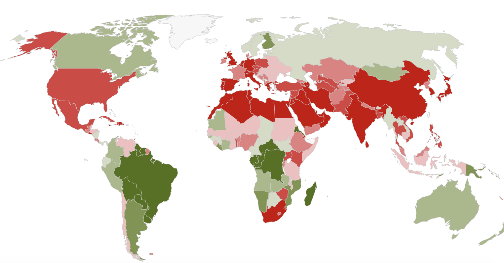
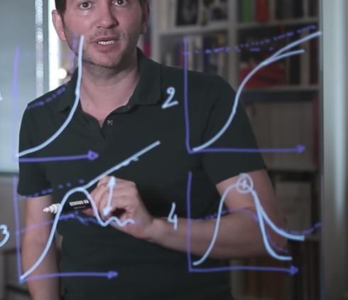

# Ecosystemic / Biocapacity

[http://data.footprintnetwork.org/\#/](http://data.footprintnetwork.org/#/) Map of bio-capacity overuse per country

#### 4  scenarios of future evolution

Effondrement : seul scénario réaliste ? Par Arthur Keller  [https://youtu.be/kLzNPEjHHb8](https://youtu.be/kLzNPEjHHb8)

4  scenarios of future evolution with the curve of human global footprint and bio-capacity of planet earth 

1/ the footprint keep augmenting quickly and the bio-capacity as well there is not limit : totally irealistic   
****2/ the footprint still augment but at a lower pace : not  realistic as the biocapacity is already exceeded  
3/ the footprint will lower to pass under bio-capacity \(décroissance\) or still raise with a decorrelation between economy and ecological footprint \(most of our ecological policies are claiming that\) : not realist that ecological footprint and economy decorrelate   
4/ the collapse : bio-capacity is collapsing because of human overuse : then 2 sub-scenario : catastrophic collapse and mitigated collapse where 

