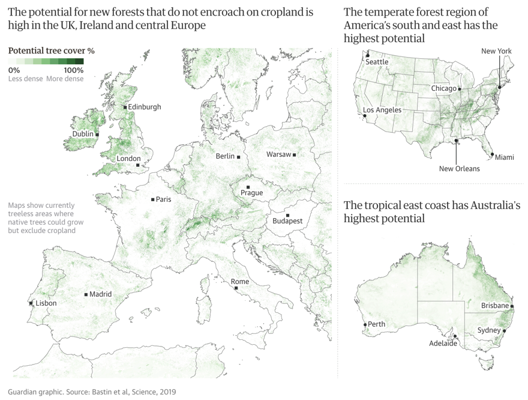

# Planting Trees

### **Which trees to plant?** 

### **Where to plant?** 

* cities 
* waste lands 
* ...

* Treepedia an explorer of tree density in major cities [http://senseable.mit.edu/treepedia](http://senseable.mit.edu/treepedia/cities/s%C3%A3o%20paulo)
* [https://www.theguardian.com/environment/2019/jul/04/planting-billions-trees-best-tackle-climate-crisis-scientists-canopy-emissions](https://www.theguardian.com/environment/2019/jul/04/planting-billions-trees-best-tackle-climate-crisis-scientists-canopy-emissions?CMP=Share_AndroidApp_Gmail)
* Végétaliser les villes [https://usbeketrica.com/article/canicule-vegetaliser-les-villes-maintenant-encore-possible](https://usbeketrica.com/article/canicule-vegetaliser-les-villes-maintenant-encore-possible)

### How to calculate benefits of planting trees?

* Planting 1.2 trillions trees could cancel out a decade of CO2 emissions [https://e360.yale.edu/digest/planting-1-2-trillion-trees-could-cancel-out-a-decade-of-co2-emissions-scientists-find](https://e360.yale.edu/digest/planting-1-2-trillion-trees-could-cancel-out-a-decade-of-co2-emissions-scientists-find)
* Est-ce que planter des arbres permet toujours de capturer du CO2 ?[https://usbeketrica.com/article/planter-milliards-arbres-suffira-t-il-a-absorber-emissions-co2](https://usbeketrica.com/article/planter-milliards-arbres-suffira-t-il-a-absorber-emissions-co2)

### Organizations / Projects that helps plant trees

* **Ecosia** [**https://info.ecosia.org/**](https://info.ecosia.org/) ****plant trees while you are surfing on the web 
* Trillion tree campaign [https://www.trilliontreecampaign.org](https://www.trilliontreecampaign.org) map and data about trees planted by many organizations
* **Trees for the future** [https://trees.org](https://trees.org) Organization that helps people plant trees or donate to offset your carbon footprint by planting trees  

