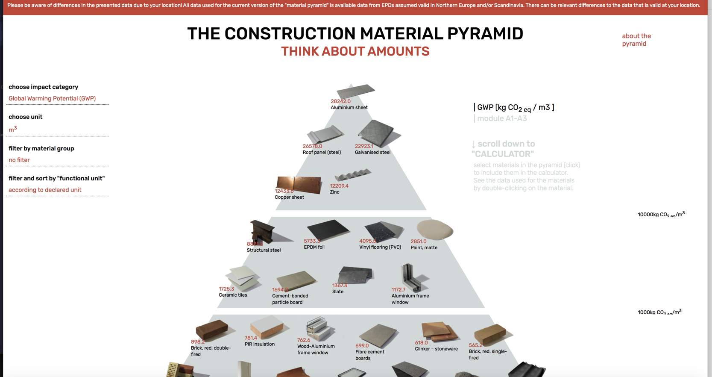

# Materials

### Bio-source materials

In French catalogue of bio sourced material [https://www.ekopolis.fr/ressource/des-produits-biosources-durables-pour-les-acheteurs-publics-et-prives\#target-documentation](https://www.ekopolis.fr/ressource/des-produits-biosources-durables-pour-les-acheteurs-publics-et-prives#target-documentation)

### Pyramid of construction materials 

A very useful diagram to see what contribution of CO2 emission depending on the material 



